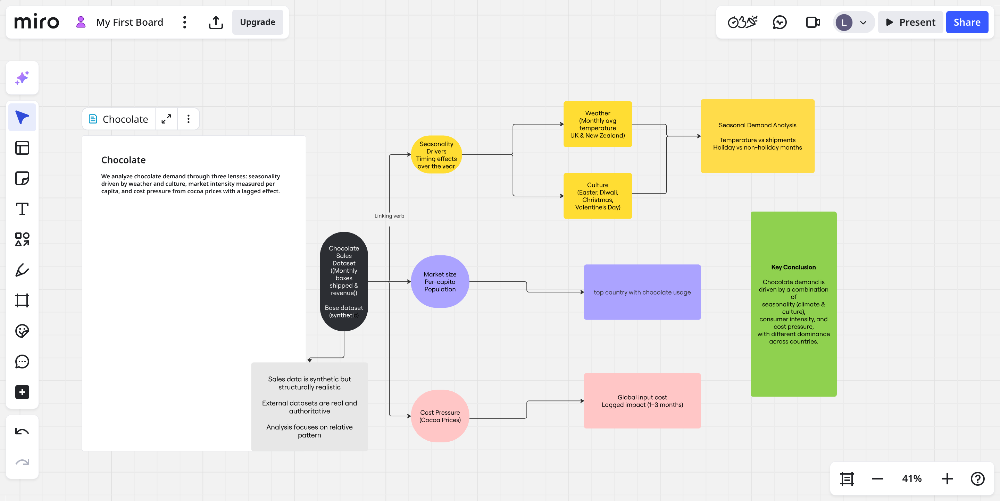

# Chocolate
Is chocolate demand driven more by climate, culture, or cost?

# Chocolate Demand Concept Map

# Introduction to the topic
Our main topic for this analysis of data is about the consumption of cocoa and chocolate.

This project aims to explore key questions related to the cocoa and chocolate markets. Specifically, we focus on the following points:

* Cost pressure in the cocoa market
    - We will examine price data to understand whether the cocoa market is experiencing significant cost pressures.

* Market size per capita
    - We will identify the top chocolate-consuming countries, both in absolute terms and relative to population size.
   
* Seasonality in consumption
    - We aim to explore whether chocolate consumption is influenced by seasonal factors. For this, we will analyse two sets of countries:

        - United Kingdom (UK) and New Zealand (NZ): smaller territories where weather patterns may have an impact on consumption.

        - USA (US), Canada (CA), India (IN), Australia (AU): the Big Four, larger countries where national holidays, long periods of free time, and population size may affect consumption trends.

By examining these aspects, we aim to provide insights into the dynamics of chocolate consumption and the factors that influence it across different countries and contexts.

Further questions to be examined include whether smaller countries (UK, NZ) are also affected by seasonality due to holidays.

Moreover, we present the implementation of a country index called The Cocoa Factor (TCF) with units names as cocoa crystals.

# Steps
1. Defining the topic
2. Finding a proper dataset
3. Reading the raw data into Python
4. Cleansing the data in Python
5. Upload the data to database tables

# Files
1. nz_data_cleansing.ipynb: Process of data cleansing for New Zealand weather data
2. uk_data_cleansing.ipynb: Process of data cleansing for United Kingdom weather data
3. upload_to_database.ipynb: Upload process of weather data to the database with SQLAlchemy and PostgreSQL
4. cocoa_prices_2022_2025.ipynb: Exploratory data a nalysis (EDA) for the prices of cocoa
5. population_2022_2025.ipynb: EDA for population changes during the years
6. EDA_weather: EDA of the weather patterns in UK and NZ
7. EDA_holidays: EDA of the holidays list for the Big Four countries (US, CA, IN, AU)
8. questions_hypothesis.ipynb: Main questions analysis
9. more_questions.ipynb: Further questions and TCF index/crystals scale

# Data credits and licenses
1. UK weather data by [Open-Meteo.com](https://open-meteo.com/en/licence)
2. NZ weather data by [NIWA](https://data.niwa.co.nz/pages/license/non-commercial)
3. Public holidays in every country 2022 from [Kaggle](https://www.kaggle.com/datasets/prasertk/public-holidays-in-every-country-in-2022)
4. Chocolate sales from [Kaggle](https://www.kaggle.com/datasets/saidaminsaidaxmadov/chocolate-sales/data)
5. Cocoa prices [Kaggle](https://www.kaggle.com/datasets/achazngwouanzi/cocoa-daily-prices-from-1994-to-2025-icco)
6. Population [Kaggle](https://www.kaggle.com/datasets/ashrafkhetran/world-population-and-forecasting)
